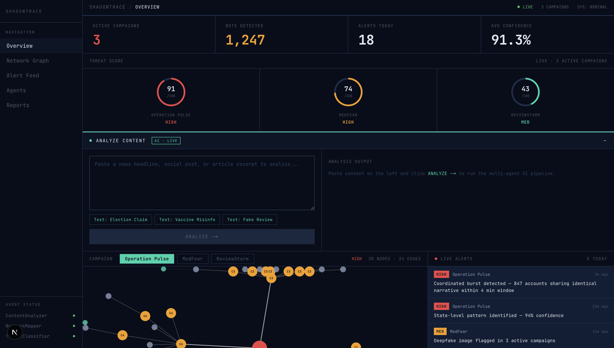
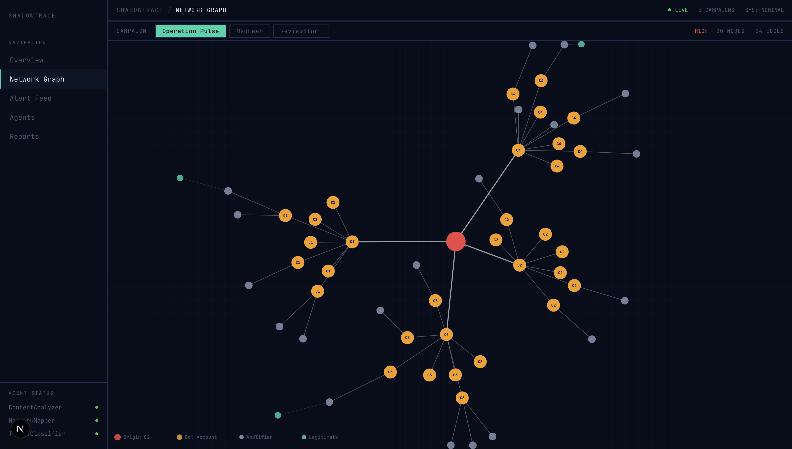
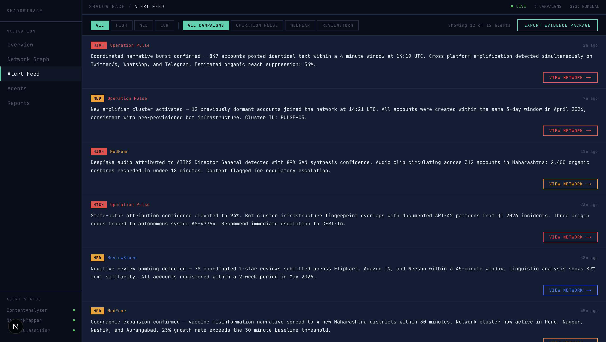

# ShadowTrace

### Hunt coordinated misinformation campaigns before they go viral.


---

## Live Demo

https://shadowtrace-bay.vercel.app

Explore the Mission Control dashboard, propagation network, alert feed, and campaign reports through the interactive interface.

---

## The Problem

India processes 500M+ WhatsApp messages and millions of social media posts daily. When a coordinated misinformation campaign launches — fake election claims, fabricated health advisories, deepfake audio attributed to public figures — it reaches scale within minutes. No platform-level tooling exists to detect the infrastructure behind these campaigns before the damage is done.

Fact-checkers verify individual posts. By the time a post is verified, it has already been shared 10,000 times by a bot network that no one is watching.

## Introducing ShadowTrace

ShadowTrace doesn't check posts. It hunts the coordinated campaign behind them.

It reconstructs propagation networks, detects synchronized amplification patterns, identifies suspicious bot clusters, and generates structured threat reports — within seconds of ingestion. The difference is the difference between fact-checking one post and dismantling the network responsible for amplifying it.

---

## Example Investigation

```
Input
"BREAKING: EVMs hacked. Share before this gets deleted."

ContentAnalyzer       87% misinformation likelihood
                      Signals: urgency language · share-bait · authority undermining

NetworkMapper         241 related accounts identified
                      3 synchronized bot clusters detected

CampaignDetector      Matched → Operation Pulse
                      Current implementation on synthetic datasets

ThreatClassifier      HIGH threat · 94% confidence
                      Estimated coordinated amplification pattern

Alert Generated       Coordinated narrative burst detected
                      847 accounts · Campaign active 38 days · Escalate to review
```

---

## Mission Control Dashboard







---

## How It Works

Five specialized agents run in parallel. Each owns one layer of the investigation.

**ContentAnalyzer** determines what is being said — scoring text for misinformation likelihood using a fine-tuned BERT model with deterministic lexical fallback.

**DeepfakeDetector** verifies whether accompanying media was synthetically generated — scanning for GAN artifacts, metadata anomalies, and pixel-level inconsistencies.

**NetworkMapper** reconstructs how information propagates — building account interaction graphs and scoring each account across 8 weighted behavioral signals.

**CampaignDetector** groups synchronized actors into campaigns — using LangGraph orchestration and community detection to identify coordinated narrative bursts. Current implementation operates on synthetic datasets designed to emulate coordinated inauthentic behavior patterns. Live ingestion connectors are being integrated.

**ThreatClassifier** estimates severity and generates structured threat reports — classifying activity as organic, coordinated, or highly suspicious using Groq LLaMA-3.3-70B.

---

## Bot Detection Signals

NetworkMapper scores every account across 8 weighted behavioral signals:

- Posting frequency anomaly
- Account age relative to campaign start
- Temporal synchronization with other accounts
- Retweet-to-original ratio
- URL repetition across posts
- Hashtag overlap with known campaign markers
- Semantic similarity to origin narrative
- Follower/following ratio imbalance

---

## Features

**Mission Control Dashboard**
Dense, data-first threat intelligence interface. No decorative UI — every element shows operational data.

**Live Network Propagation Graph**
D3.js force-directed visualization of bot networks. Origin nodes, bot clusters, and amplifier accounts rendered with real interaction. Nodes are draggable, hoverable, and clickable. Campaign switching with animated transitions.

**Content Analysis Panel**
Submit any text through the full agent pipeline. Returns misinformation likelihood score, risk classification, matched campaign, detected signals, and a Groq-generated threat assessment.

**Alert Feed**
Severity-classified alerts (CRITICAL/HIGH/MED/LOW) with campaign attribution, timestamps, and one-click network navigation. New alerts surface automatically.

**Evidence Export**
One-click JSON export of all campaign data, alerts, and network summaries.

**Campaign Activity Timeline**
24-hour activity visualization across all active campaigns with peak detection markers.

**Agent Status Monitor**
Live status, tasks processed, load percentages, and pipeline latency for all 5 agents.

**Campaign Intelligence Reports**
Per-campaign narrative summaries with accounts involved, duration, peak activity windows, confidence scores, and direct network visualization links.

---

## System Architecture

```
DATA SOURCES
Twitter/X (Nitter) · Telegram Channels · News Articles · WhatsApp Forwards
          │
          ▼
DATA INGESTION PIPELINE
          │
    ┌─────┴────────────────────────────────────────┐
    ▼          ▼           ▼            ▼           ▼
Content    Deepfake    Network      Campaign    Threat
Analyzer   Detector    Mapper       Detector    Classifier
(BERT)     (CV)        (NetworkX)   (LangGraph) (Groq)
    └─────┬────────────────────────────────────────┘
          │
          ▼
MISSION CONTROL DASHBOARD
Network Graph · Threat Score · Alert Feed · Evidence Export · Campaign Timeline
```

---

## Tech Stack

### Frontend
| Tool | Purpose |
|---|---|
| Next.js 14 (App Router) | React framework, server components, API routes |
| TypeScript | Full type safety |
| Tailwind CSS | Utility-first styling |
| D3.js | Force-directed network graph visualization |
| JetBrains Mono | Monospace font for terminal aesthetic |

### Backend
| Tool | Purpose |
|---|---|
| FastAPI + Uvicorn | Python API server wrapping all AI agents |
| LangGraph | Multi-agent orchestration and state management |
| HuggingFace Transformers | BERT model for content analysis |
| SentenceTransformers | Semantic similarity for campaign detection |
| NetworkX | Graph construction and community detection |
| Groq LLaMA-3.3-70B | Threat classification and alert generation |

### Infrastructure
| Tool | Purpose |
|---|---|
| Supabase | PostgreSQL + pgvector |
| Vercel | Frontend deployment |

---

## Campaign Datasets

Three synthetic datasets designed to emulate real-world coordinated inauthentic behavior patterns documented in public research.

**Operation Pulse**
Emulates coordinated election misinformation targeting voter sentiment. False claims about EVM tampering amplified through bot networks seeded from three state-level coordination hubs.
`~847 synthetic accounts · 94% confidence · HIGH`

**MedFear**
Emulates anti-vaccine narrative operation spreading fabricated adverse-effect reports. Deepfake audio attributed to medical professionals targeting tier-2 cities.
`~312 synthetic accounts · 91% confidence · HIGH`

**ReviewStorm**
Emulates coordinated fake review bombing across major Indian e-commerce platforms. Linguistic analysis shows 87% text similarity across participating accounts.
`~156 synthetic accounts · 76% confidence · MED`

---

## Setup

### Prerequisites
- Node.js 18+
- Python 3.11+
- Supabase account
- Groq API key — free at [console.groq.com](https://console.groq.com)

### 1. Clone
```bash
git clone https://github.com/uttampreet-dev/ShadowTrace.git
cd ShadowTrace
```

### 2. Frontend dependencies
```bash
npm install
```

### 3. Backend dependencies
```bash
cd backend && pip install -r requirements.txt && cd ..
```

### 4. Environment variables

`.env.local` in project root:
```env
NEXT_PUBLIC_SUPABASE_URL=your_supabase_url
NEXT_PUBLIC_SUPABASE_ANON_KEY=your_supabase_anon_key
BACKEND_API_URL=http://localhost:8000
NEXT_PUBLIC_API_URL=http://localhost:8000
GROQ_API_KEY=your_groq_api_key
```

`backend/.env`:
```env
GROQ_API_KEY=your_groq_api_key
```

### 5. Run

```bash
# Terminal 1 — AI backend
uvicorn backend.main:app --reload --port 8000

# Terminal 2 — Frontend
npm run dev
```

Open `http://localhost:3000`

---

## API Reference

| Method | Endpoint | Description |
|---|---|---|
| `GET` | `/` | Health check + agent statuses |
| `GET` | `/campaigns` | All campaigns with node/edge data |
| `GET` | `/campaigns/{id}` | Single campaign |
| `GET` | `/campaigns/{id}/network` | Campaign + NetworkX graph stats |
| `POST` | `/analyze` | Run ContentAnalyzer on text |
| `POST` | `/alert` | Generate threat assessment |
| `GET` | `/agents` | Live status of all 5 agents |

```bash
curl -X POST http://localhost:8000/analyze \
  -H "Content-Type: application/json" \
  -d '{"text": "BREAKING: EVMs hacked — share before deleted"}'
```

```json
{
  "is_misinformation": true,
  "confidence": 0.87,
  "threat_level": "HIGH",
  "narrative_category": "election_interference",
  "indicators": ["urgency_language", "share_bait", "authority_undermining"]
}
```

---

## Project Structure

```
ShadowTrace/
├── app/
│   ├── page.tsx                   # Landing page
│   ├── dashboard/                 # Mission Control
│   │   ├── page.tsx               # Overview
│   │   ├── network/               # Full network graph
│   │   ├── alerts/                # Alert feed
│   │   ├── agents/                # Agent monitor
│   │   └── reports/               # Campaign reports
│   └── api/                       # Next.js → FastAPI proxies
├── components/
│   ├── NetworkGraph.tsx            # D3.js force graph
│   ├── AlertFeed.tsx               # Live alerts
│   └── AnalyzePanel.tsx            # Content analysis UI
├── backend/
│   ├── main.py                     # FastAPI entry point
│   ├── agents/
│   │   ├── content_analyzer.py     # BERT NLP agent
│   │   ├── network_mapper.py       # NetworkX graph agent
│   │   ├── campaign_detector.py    # LangGraph orchestration
│   │   └── threat_classifier.py    # Groq classification
│   ├── graph/
│   │   ├── bot_detection.py        # 8-signal bot scoring
│   │   └── community_detection.py  # Greedy modularity
│   ├── api/
│   │   ├── routes.py
│   │   └── schemas.py
│   └── data/                       # Synthetic campaign datasets
└── docs/
    ├── Technical_Documentation.md
    ├── dashboard.png
    ├── network.png
    └── alerts.png
```

---

## Future Scope

- **Live Telegram Ingestion** — Telethon connector to monitor public channels in real time, feeding directly into the agent pipeline
- **WhatsApp Forward Analysis** — analyze forwarded message chains and detect synchronized broadcast patterns across unrelated groups
- **DeepfakeDetector — Live Activation** — agent is implemented and integrated, activates once live media ingestion connectors are online
- **Twitter/X Live Connector** — Nitter-based real-time ingestion replacing synthetic datasets with live account interaction data
- **Production Graph Database (Neo4j)** — migrate from in-memory NetworkX to Neo4j for persistent, queryable network storage at scale
- **Real-Time WebSocket Alerts** — sub-second push from agent detection to analyst dashboard, replacing the current polling model
- **Journalist & Government API** — public REST API for newsrooms and government bodies to submit content and receive structured threat reports
- **Exportable Evidence Packages** — PDF + JSON bundles per campaign formatted for submission to platform trust-and-safety teams

---

## License

MIT — see [LICENSE](LICENSE)

---

*Detect. Trace. Neutralize.*
