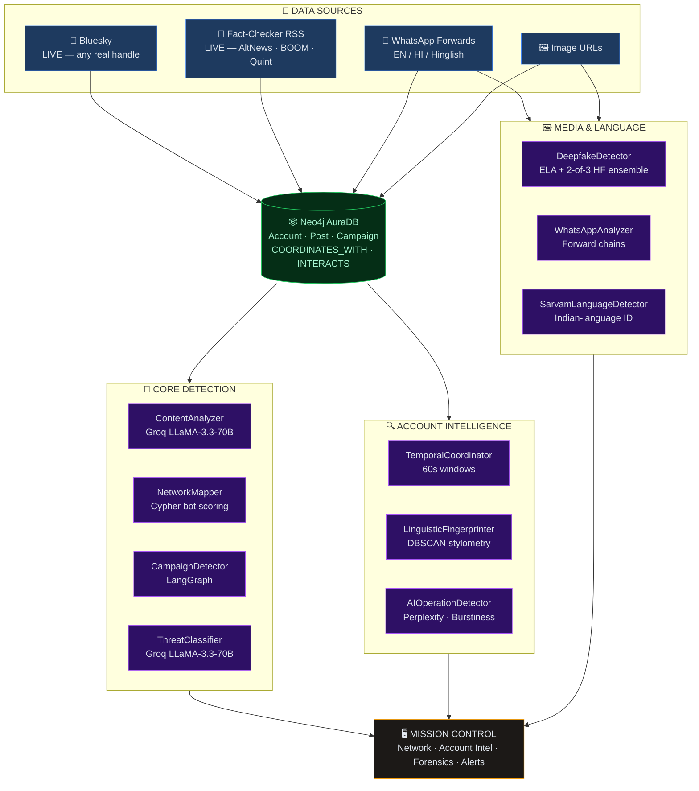

# 🕵️ ShadowTrace

### Fact-checking debunks the post. **ShadowTrace dismantles the network behind it.**

Real-time threat intelligence for **coordinated misinformation campaigns**. Paste in a WhatsApp forward, an image, or *any real social handle* — ShadowTrace ingests it into a live Neo4j graph, runs **10 specialised AI agents** across it, and hands back the campaign: **which accounts coordinated, how tightly, in what language, and how dangerous.**

> **This is not a fixture.** Type your own Bluesky handle into the [live demo](https://shadowtrace-bay.vercel.app) — a handle we could never have pre-seeded. It gets fetched from the public API, written into the graph, and analysed *inside that request*. We [show you how to falsify it](#-dont-take-our-word-for-it--falsify-it) below.

<p align="center">
  
  
  
  
  
  
  
  
  
  
</p>

<p align="center">
  <b>🏆 Tracks:</b>
  
  
</p>

<p align="center">
  <b><a href="https://shadowtrace-bay.vercel.app">🔴 Live Mission Control</a></b> ·
  <a href="#-demo--deliverables">Demo Video</a> ·
  <a href="#-how-to-run-the-project">Run Locally</a> ·
  <a href="docs/Technical_Documentation.md">Technical Docs</a>
</p>

---

## 📌 Problem & Domain

A coordinated misinformation campaign — a fabricated EVM-hacking claim, a fake health advisory, deepfake audio attributed to a doctor — reaches millions in India **within minutes**. The infrastructure behind it is not one bad post. It is hundreds of accounts pushing the same narrative inside the same 60-second window, seeded from a handful of coordination hubs.

Today's defence is fact-checking, and fact-checking is **post-level and retrospective**. By the time a claim is verified and debunked, the network that pushed it has already moved 10,000 shares and started on the next narrative. Fact-checking scales *linearly*; the attack scales *exponentially*. **Nobody is watching the network.**

**Our thesis: coordination is a graph problem, not a text problem.** A bot's real tell isn't *what* it said — it's that it said it **twelve seconds after forty other accounts did**. That's a relationship, not a property of a sentence. So we stopped classifying posts and started reconstructing networks — which is why the whole system is built on a graph database, and why the network signal outweighs the content signal in our own scoring.

**Themes Selected:**

- [x] **Trust, Identity & Security** — **`PRIMARY`**
  Coordinated inauthentic behaviour detection, bot-network attribution, synthetic-media forensics. Every agent in the pipeline exists to answer a trust question: *is this account real, is this image real, is this coordination real?*
- [x] **Media, Social & Interactive Platforms** — **`SECONDARY`**
  Live ingestion and forensic analysis of social propagation across Bluesky, WhatsApp forwards, and Indian fact-checker feeds.
- [x] **Public Systems, Governance and Civic Tech** — **`TERTIARY`**
  Election integrity and public-health information defence — built for newsrooms, election commissions, and public-health information cells.

---

## 🎯 Objective

**The target users**
Newsroom fact-checkers (Alt News, BOOM, The Quint), election-commission and public-health information cells, and platform trust-and-safety teams.

**The pain point**
Existing tools answer *"is this post false?"* — a question that arrives too late and scales linearly with the flood. Nobody can answer the question that actually matters: *"**Which** accounts are pushing this together, **since when**, **how tightly** are they synchronised, and **who** is the hub?"* — not without a data-science team and weeks of manual work.

**The value we provide**
ShadowTrace turns a single suspicious message, image, or account handle into a **complete campaign dossier in under a minute**:

| You give it | It gives you back |
|---|---|
| A WhatsApp forward | Misinformation score, forward-chain markers, Hindi/Hinglish language ID, live fact-checker cross-reference, threat class |
| A real Bluesky handle | Live-ingested post graph, 60-second coordination windows, stylometric cluster peers, LLM-authorship signals |
| An image URL | ELA heatmap of edited regions, EXIF anomalies, two-model AI-generation verdict |
| A claim or narrative | The bot cluster amplifying it, campaign attribution, severity, and an exportable evidence package |

The difference is the difference between debunking one post and **dismantling the network responsible for it**.

---

## 🔬 Don't Take Our Word For It — Falsify It

Most hackathon demos are fixtures with a loading spinner. Here is how to **prove ours isn't**, in under a minute, on the [live deployment](https://shadowtrace-bay.vercel.app):

| # | Do this | Why it can't be faked |
|---|---|---|
| **1** | Open **Account Intel** and type in **your own** Bluesky handle — or any handle you invent on the spot | We can't have pre-seeded a handle we've never seen. It is fetched from the Bluesky public API, `MERGE`d into Neo4j, and analysed by the same Cypher our seeded campaigns use |
| **2** | Open **Live Feed** | Those are today's debunked claims, pulled live from Alt News / BOOM / FactChecker.in / The Quint RSS. Cross-check any headline against their site |
| **3** | Open **Agent Monitor**, then go run an analysis and come back | Task counts **go up**. They're read from an in-process counter (`agent_stats.py`), not a hardcoded array |
| **4** | Paste a **real photograph** into Image Forensics | It should *not* be flagged as AI-generated. Getting this right cost us a rebuild — see below |

**Or skip the UI entirely and hit production directly.** Pick any Bluesky handle — one we could not possibly have seeded:

```bash
curl -X POST https://shadowtrace-backend-g6uy.onrender.com/account-intel/analyze \
  -H "Content-Type: application/json" \
  -d '{"handles": ["bsky.app"]}'
```
```jsonc
{
  "sources": { "bsky.app": "bluesky" },   // ← fetched live, MERGEd into AuraDB
  "temporal":     { "score": 0,  "flagged_pairs": 0, "timeline": [ /* 20 real posts */ ] },
  "ai_operation": { "score": 17.8, "verdict": "LIKELY_HUMAN" }
}
```

`"source": "bluesky"` means that handle **was not in our graph** — it was pulled from the Bluesky API, written into Neo4j, and analysed back out of it, in that request. Swap in your own handle and watch it happen. The `LIKELY_HUMAN` verdict on a real account is the point too: **a detector that flags everything is worthless.**

*(Render free tier cold-starts — the first request after idle can take up to a minute to wake the backend.)*

---

## 🧠 Team & Approach

### Team Name:
`Trace Matrix`

### Team Members:
- **Uttampreet Kaur** — [GitHub @uttampreet-dev](https://github.com/uttampreet-dev)
- **Aditya Bhandari** — [GitHub @Neverask1121](https://github.com/Neverask1121)

### Your Approach:

**Why we chose this problem.**
Every hackathon builds a fake-news *classifier*. We asked a harder question: a classifier tells you a post is false — so what? The post is already viral. The real adversary is an **operation**: coordinated, funded, multi-account, and completely invisible to post-level tooling. Nobody was building the counter-tool for that, so we did.

**Key challenges we addressed.**

1. **Coordination is a graph problem, not a text problem.** A bot's giveaway isn't *what* it says — it's that it said it 12 seconds after 40 other accounts did. We modelled accounts, posts, campaigns and `COORDINATES_WITH` edges in **Neo4j AuraDB**, so synchronisation becomes a first-class, queryable relationship instead of something we recompute in memory on every request.

2. **"AI-generated" is a verdict you cannot get wrong.** Our first image-forensics build flagged real photographs as AI-generated on a single model's say-so. We rebuilt it to require **two independent classifiers to agree** before making that call — and made the AI-generation verdict unable to veto the ELA editing evidence, so a real-but-doctored photo still gets caught. Being loudly wrong is worse than being quiet.

3. **India doesn't post in English.** A WhatsApp forward is Hindi, Hinglish, or Devanagari-script code-mixing. We wired in **Sarvam AI's language ID** and built the forward-chain detector around Indian-language urgency and share-bait patterns rather than translated English heuristics.

4. **Demos lie; we wanted live wires.** Anyone can hardcode a graph. ShadowTrace ingests **real Bluesky accounts** and **real debunked claims from live Indian fact-checker RSS feeds** — so a judge can type in their own handle, or any handle, and watch the pipeline actually run.

5. **A 512MB box made the system better.** Our host's free tier caps at 512MB, and `torch` + `transformers` OOM on load. Rather than pay for a bigger box, we deleted local model weights entirely: content scoring became a **Groq LLaMA-3.3-70B call with a deterministic lexical fallback**, and `sentence-transformers` is lazily imported behind an `lru_cache` so it never loads at startup. The backend now runs in **under 100MB** — and a 70B model comfortably outperforms the fine-tuned BERT-tiny it replaced. The constraint made it lighter *and* more accurate.

**Pivots, iterations, breakthroughs.**
We started with a BERT classifier and a pretty graph. The breakthrough was inverting the pipeline — making the **network the subject and the text merely evidence**. That reframing is what turned a fake-news demo into a threat-intelligence platform: it's why temporal coordination, stylometric fingerprinting, and LLM-operation detection run *as peers to* content analysis, not as decoration around it.

---

## 🛠️ Tech Stack

### Core Technologies Used:
- **Frontend:** Next.js 16 (App Router) · React 19 · TypeScript · Tailwind CSS v4 · **D3.js** force-directed network graph
- **Backend:** Python 3.11 · **FastAPI** + Uvicorn · **LangGraph** multi-agent orchestration · NetworkX · scikit-learn (DBSCAN)
- **Database:** **Neo4j AuraDB** (primary — accounts, posts, campaigns, coordination edges) · Supabase Postgres
- **APIs:** **Groq** (LLaMA-3.3-70B) · **Sarvam AI** (Indian-language ID) · Hugging Face Inference (AI-image classifiers) · Bluesky public API · Fact-checker RSS (Alt News, BOOM, FactChecker.in, The Quint)
- **Hosting:** **Vercel** (frontend) · **Render** (FastAPI agent backend) · Neo4j AuraDB (managed graph)

### Additional Technologies Used:
- [x] **AI / ML** — LLaMA-3.3-70B scoring & threat classification, LangGraph agent graph, DBSCAN stylometric clustering, bigram-perplexity/burstiness LLM-authorship detection, ELA + Hugging Face image forensics
- [ ] Web3 / Blockchain
- [x] **Cyber Security** — coordinated inauthentic behaviour detection, bot-network attribution, synthetic-media forensics, evidence packaging
- [x] **Cloud** — Vercel, Render, Neo4j AuraDB, Groq & Sarvam inference

---

## 🏆 Sponsored Tracks

- [x] **Neo4j Track** — AuraDB is our **primary** database
- [x] **Sarvam AI Track** — Indian-language identification, live in the analysis pipeline
- [ ] **Expo Track** — not applicable *(ShadowTrace is an analyst web console, not a mobile app)*
- [ ] **Base44 Track** — not applicable *(built from scratch; retrofitting Base44 would be cosmetic)*

---

**How we used the partner technology:**

> **🟦 Neo4j AuraDB** — Coordination *is* a graph, so AuraDB is the substrate, not a store. We model `(:Account)-[:SHARED]->(:Post)-[:PART_OF]->(:Campaign)` plus a **`COORDINATES_WITH` edge that we compute at ingest** for any two accounts posting within 60 seconds of each other. Bot scoring and cluster detection run **as Cypher inside AuraDB** and persist back onto the nodes. Live Bluesky accounts are `MERGE`d straight into the graph, and the dashboard's D3 network is a direct projection of `GET /campaigns` — not a fixture.
>
> **🟧 Sarvam AI** — Our highest-value input is a WhatsApp forward, and real Indian forwards are Hindi/Hinglish, not English. `SarvamLanguageDetector` is a **first-class agent** calling Sarvam's `text-lid`, running as **step 3 of the live 5-agent `/investigate` chain** and exposed standalone at `POST /language/detect`. Language ID feeds the scoring; it doesn't decorate it.

<details>
<summary><b>🔍 Verify it — queries, files, and failure modes</b></summary>

#### Neo4j AuraDB

```cypher
(:Account)-[:SHARED]->(:Post)-[:PART_OF]->(:Campaign)
(:Account)-[:PART_OF]->(:Campaign)
(:Account)-[:INTERACTS {relation}]->(:Account)                  // retweet · mention · reply
(:Account)-[:COORDINATES_WITH {delay_seconds}]->(:Account)      // ← the money edge
```

Bot scoring executes **inside the database** and writes the result onto the node:

```cypher
MATCH (a:Account)-[:PART_OF]->(c:Campaign {id: $campaign_id})
SET a.bot_score = (
  CASE WHEN a.post_count > 50             THEN 0.25 ELSE 0 END +
  CASE WHEN a.age_days   < 30             THEN 0.20 ELSE 0 END +
  CASE WHEN a.following  > a.followers*10 THEN 0.20 ELSE 0 END
)
RETURN a.handle, a.bot_score ORDER BY a.bot_score DESC
```

- **`COORDINATES_WITH` is computed, not seeded** — synchronised amplification becomes a **one-hop traversal** instead of an O(n²) rescan per request.
- **Clusters are community detection over that edge set** — we don't guess campaign membership, we find the densely-coordinating component.
- **Degradation:** if AuraDB is unreachable, `seed_database()` fails soft to a JSON fallback so the API stays up — but coordination traversal and cluster attribution are AuraDB-native.
- Code: [`backend/db/neo4j_client.py`](backend/db/neo4j_client.py) · [`backend/db/seed.py`](backend/db/seed.py) · [`backend/graph/bot_detection.py`](backend/graph/bot_detection.py)

#### Sarvam AI

- Patterns matched are **native Hinglish**, not translated English — `turant`, `sabko dikhao`, `sarkar chupa rahi`.
- Submit Hindi in the WhatsApp panel and the step trace shows Sarvam's **real measured latency**, live.
- **Degradation:** without `SARVAM_API_KEY`, falls back to a Devanagari-character + Hinglish function-word heuristic — the demo never dies, but the real call is what ships.
- Code: [`backend/agents/sarvam_language_detector.py`](backend/agents/sarvam_language_detector.py)

</details>

---

## ✨ Key Features

> The first four are the ones that make ShadowTrace something other tools aren't.

### ✅ 1 · Account Intelligence — *on real, live internet accounts*

**The flagship.** Type in **any real Bluesky handle** — yours, ours, one you invent on the spot. Its posts are fetched live from the Bluesky API, `MERGE`d into Neo4j, and analysed by three forensic agents running against the same Cypher our seeded campaigns use.

| Agent | What it catches |
|---|---|
| **TemporalCoordinator** | Accounts posting inside the same **60-second window** — the signature of a synchronised burst |
| **LinguisticFingerprinter** | **DBSCAN stylometric clustering** — accounts that *write like each other*, i.e. one operator behind many handles |
| **AIOperationDetector** | **Bigram perplexity, burstiness, topic drift** — posts authored by an LLM rather than a person |

Nothing here is pre-computed. Ingestion happens inside the request.

### ✅ 2 · Live Network Propagation Graph

A D3.js force-directed rendering that is a **direct projection of AuraDB** — nodes, edges and campaign membership all served from Cypher, not a fixture file. Origin nodes, bot clusters and amplifier accounts are draggable, hoverable and clickable, with animated campaign switching.

### ✅ 3 · WhatsApp Forward Analyzer — *built for how India actually spreads misinformation*

Forward-chain detection across **English / Hindi / Hinglish** (`turant`, `sabko dikhao`, `sarkar chupa rahi` — not translated English heuristics), blended with a Groq LLaMA-3.3-70B judgment.

Then one click runs a **5-agent investigation**, each stage reporting its own measured latency:

```
WhatsAppAnalyzer → ContentAnalyzer → SarvamLanguageDetector → FactCheckCrossRef → ThreatClassifier
   patterns          Groq 70B            Indian-language ID       live debunk match     severity
```

### ✅ 4 · Image Forensics — *with a verdict we refuse to get wrong*

**Error Level Analysis** heatmaps + EXIF anomaly detection, blended with a three-model Hugging Face classifier ensemble.

**Two models must independently agree** before we will call an image AI-generated — we take the *second-highest* score, so no single false positive can flag an image alone. And that verdict can **never overrule** the ELA evidence beneath it, because "not AI-generated" and "not manipulated" are different claims. A real photo edited in Photoshop still gets caught.

---

### Also in the box

- ✅ **Mission Control Dashboard** — dense, data-first console. No decorative UI; every element carries operational data.
- ✅ **Live Fact-Checker Feed** — real debunked claims streamed from **Alt News, BOOM, FactChecker.in and The Quint** RSS, each re-scored through our own content pipeline.
- ✅ **Severity-Classified Alert Feed** — CRITICAL / HIGH / MED / LOW with campaign attribution and one-click pivot into the network graph.
- ✅ **Agent Status Monitor** — **genuine** per-agent task counts read from the running backend process, not a hardcoded array. Run an analysis and watch them increment.
- ✅ **Evidence Export** — one-click JSON export of campaign data, alerts and network summaries, formatted for handoff to trust-and-safety teams.

---

## 🧬 The 10-Agent Pipeline

Everything flows through the graph. **Neo4j AuraDB is not a store the agents write to afterwards — it's the substrate they run on.**



**Bot scoring — 8 weighted signals**, four from metadata and four from graph topology:

`account age ×0.22` · `posting frequency ×0.18` · `connectivity ×0.14` · `follower/following imbalance ×0.12` · `betweenness centrality ×0.10` · `clustering coefficient ×0.10` · `PageRank ×0.08` · `unverified penalty`

The topology signals are the ones that matter. **Betweenness** finds the bridge accounts wiring separate clusters together — which is exactly where a campaign's coordination hubs sit.

> **📖 Deeper diagrams** — graph data model, live-ingestion sequence, the 5-agent chain, the image-forensics decision tree, and the LangGraph state machine all live in **[docs/Architecture_Diagram.md](docs/Architecture_Diagram.md)**, with full agent reference in **[docs/Technical_Documentation.md](docs/Technical_Documentation.md)**.

---

## 📽️ Demo & Deliverables

- **Demo Video Link (Mandatory):** `[Paste your <5 min demo video link here]`
- **Deployment Link:** **https://shadowtrace-bay.vercel.app**
- **Pitch Deck / PPT:** [View the deck](https://drive.google.com/file/d/1eyKBDLJjRpeZMWQr5PLIwWQ2vtXuUvv9/view?usp=sharing)
- **Technical Documentation:** [docs/Technical_Documentation.md](docs/Technical_Documentation.md) · [Architecture Diagrams](docs/Architecture_Diagram.md)
- **Live API:** [`shadowtrace-backend-g6uy.onrender.com`](https://shadowtrace-backend-g6uy.onrender.com/docs) — interactive OpenAPI docs

---

## ✅ Tasks & Bonus Checklist

- [ ] All team members completed the mandatory social task
- [ ] Bonus Task 1 – Badge sharing
- [ ] Bonus Task 2 – Blog/article

---

## 🧪 How to Run the Project

### Requirements
- **Node.js** 20+ *(required by Next.js 16)*
- **Python** 3.11+
- **Neo4j AuraDB** instance — free at [neo4j.com/cloud/aura](https://neo4j.com/cloud/aura/)
- **Groq API key** — free at [console.groq.com](https://console.groq.com)
- *(Optional)* Sarvam AI key (Indian-language ID), Hugging Face token (AI-image classifiers), Supabase project

### Local Setup

```bash
# 1. Clone
git clone https://github.com/uttampreet-dev/ShadowTrace.git
cd ShadowTrace

# 2. Frontend dependencies
npm install

# 3. Backend dependencies
pip install -r backend/requirements.txt
```

**4. Environment variables**

`.env.local` in the project root:
```env
NEXT_PUBLIC_SUPABASE_URL=your_supabase_url
NEXT_PUBLIC_SUPABASE_ANON_KEY=your_supabase_anon_key
GROQ_API_KEY=your_groq_api_key
BACKEND_API_URL=http://localhost:8000
NEXT_PUBLIC_API_URL=http://localhost:8000
```

`backend/.env`:
```env
GROQ_API_KEY=your_groq_api_key

# Neo4j AuraDB — the graph substrate
NEO4J_URI=neo4j+s://xxxxxxxx.databases.neo4j.io
NEO4J_USERNAME=neo4j
NEO4J_PASSWORD=your_aura_password

# Optional — omit and the system degrades gracefully (see table below)
SARVAM_API_KEY=your_sarvam_key
HF_API_KEY=your_huggingface_token
```

**5. Run** — two terminals:

```bash
# Terminal 1 — AI agent backend (seeds AuraDB on startup)
uvicorn backend.main:app --reload --port 8000

# Terminal 2 — Mission Control frontend
npm run dev
```

Open **http://localhost:3000** → **Launch Mission Control**.

> **Try it in 30 seconds:** open **Account Intel**, drop in any real Bluesky handle, and watch it get ingested into the graph and scored for coordination live.

### API Reference

| Method | Endpoint | Description |
|---|---|---|
| `GET` | `/` | Health check |
| `GET` | `/campaigns` | All campaigns + node/edge data **(Cypher → AuraDB)** |
| `POST` | `/analyze-text` | Groq LLaMA-3.3-70B misinformation scoring |
| `POST` | `/analyze-network` | 8-signal bot scoring over the account graph |
| `POST` | `/detect-campaign` | LangGraph campaign-detection pipeline |
| `POST` | `/generate-alert` | Groq threat classification |
| `POST` | `/investigate` | Full 5-agent investigation of one message |
| `POST` | `/whatsapp/analyze` | WhatsApp forward analysis (patterns + LLM) |
| `POST` | `/account-intel/analyze` | Temporal + stylometric + AI-operation analysis (live Bluesky ingestion → Neo4j) |
| `POST` | `/deepfake/analyze` | ELA forensics + two-model AI-image verdict |
| `POST` | `/language/detect` | Sarvam Indian-language identification |
| `GET` | `/live-feed` | Live debunked claims from fact-checker RSS |
| `GET` | `/agents/status` | Real per-agent task counts from the running process |

```bash
curl -X POST http://localhost:8000/analyze-text \
  -H "Content-Type: application/json" \
  -d '{"text": "BREAKING: EVMs hacked — share before this gets deleted"}'
```
```json
{
  "misinformation_score": 87,
  "confidence": 0.87,
  "signals": { "lexical_score": 0.34, "model_score": 0.95, "score_blend": 0.87 }
}
```

The score is a deliberate blend — `0.85 × LLaMA-3.3-70B + 0.15 × deterministic lexical`. The lexical half is not decoration: it is the **offline fallback**, so the endpoint keeps returning a defensible score when Groq is down.

### Degradation — Nothing Hard-Fails

Every external dependency has a defined failure mode. Pull any plug and the system stays up, just quieter:

| Pull this plug | What happens |
|---|---|
| **Neo4j unreachable** | JSON campaign fallback → in-memory NetworkX pipeline |
| **Groq down** | Deterministic lexical scorer + rule-based threat classifier |
| **No `HF_API_KEY`** | ELA + EXIF forensics still run; AI-generation verdict omitted |
| **No `SARVAM_API_KEY`** | Regex EN/HI/Hinglish heuristic takes over |
| **A fact-checker feed is down** | Skipped silently; the other three still serve |
| **Only one HF model responds** | Score clamped to 0.49 — **it cannot flag an image alone** |

---

## 🗂️ Project Structure

```
ShadowTrace/
│
├── app/                                  # Next.js 16 App Router
│   ├── page.tsx                          # Landing — scroll-journey globe
│   ├── layout.tsx
│   ├── globals.css
│   │
│   ├── dashboard/                        # ── MISSION CONTROL ──
│   │   ├── page.tsx                      # Overview
│   │   ├── layout.tsx
│   │   ├── account-intel/page.tsx        # ★ Live Bluesky → Neo4j intel
│   │   ├── network/page.tsx              # ★ D3 propagation graph
│   │   ├── whatsapp/page.tsx             # ★ Forward analyzer + 5-agent run
│   │   ├── image-forensics/page.tsx      # ★ ELA + AI-image ensemble
│   │   ├── alerts/page.tsx               # Severity-classified alert feed
│   │   ├── agents/page.tsx               # Live agent task counts
│   │   ├── reports/page.tsx              # Campaign intelligence reports
│   │   └── _components/
│   │       ├── NetworkGraph.tsx          # D3 force simulation
│   │       ├── NetworkGraphPanel.tsx
│   │       ├── AnalyzePanel.tsx
│   │       ├── AlertFeed.tsx
│   │       ├── LiveClaimsCell.tsx
│   │       ├── Sidebar.tsx
│   │       └── Topbar.tsx
│   │
│   └── api/                              # Next.js → FastAPI proxy layer
│       ├── account-intel/route.ts
│       ├── investigate/route.ts
│       ├── deepfake/route.ts
│       ├── whatsapp/route.ts
│       ├── campaigns/route.ts
│       ├── live-feed/route.ts
│       ├── analyze/route.ts
│       ├── alert/route.ts
│       └── agents/route.ts
│
├── components/
│   ├── account-intel/
│   │   ├── TemporalHeatmap.tsx           # 60s coordination windows
│   │   ├── FingerprintCluster.tsx        # DBSCAN stylometric clusters
│   │   ├── AIOperationScores.tsx         # Perplexity · burstiness · drift
│   │   └── VerdictPanel.tsx
│   ├── landing/OutbreakCanvas.tsx        # Live outbreak simulation
│   ├── WhatsAppAnalyzer.tsx
│   ├── DeepfakeAnalyzer.tsx
│   └── LiveFeedPanel.tsx
│
├── backend/                              # ── FastAPI AI BACKEND (Render) ──
│   ├── main.py                           # Entry point; seeds AuraDB on startup
│   │
│   ├── agents/                           # ── THE 10-AGENT ROSTER ──
│   │   ├── content_analyzer.py           # Groq LLaMA-3.3-70B + lexical blend
│   │   ├── network_mapper.py             # Cypher bot scoring · PageRank
│   │   ├── campaign_detector.py          # LangGraph state machine
│   │   ├── threat_classifier.py          # Groq severity + rationale
│   │   ├── temporal_coordinator.py       # 60s coordination windows
│   │   ├── linguistic_fingerprinter.py   # DBSCAN stylometry
│   │   ├── ai_operation_detector.py      # LLM-authorship signals
│   │   ├── deepfake_detector.py          # ELA + EXIF forensics
│   │   ├── ai_image_detector.py          # 3-model HF ensemble (2-of-N rule)
│   │   ├── whatsapp_analyzer.py          # EN/HI/Hinglish forward chains
│   │   ├── sarvam_language_detector.py   # Sarvam text-lid
│   │   ├── bluesky_ingestion.py          # Live account → Neo4j
│   │   ├── fact_checker_ingestion.py     # Alt News · BOOM · Quint RSS
│   │   └── agent_stats.py                # Real in-process task counters
│   │
│   ├── db/                               # ── NEO4J AURADB ──
│   │   ├── neo4j_client.py               # Driver + Cypher runner
│   │   ├── seed.py                       # Campaign seeding · COORDINATES_WITH
│   │   └── seed_demo.py                  # Demo account timelines
│   │
│   ├── graph/
│   │   ├── bot_detection.py              # 8-signal composite + Cypher scoring
│   │   └── community_detection.py        # Label propagation · greedy modularity
│   │
│   ├── api/
│   │   ├── routes.py                     # All endpoints
│   │   └── schemas.py                    # Pydantic request/response models
│   │
│   ├── data/                             # Synthetic campaign datasets
│   │   ├── campaign_1.json               # Operation Pulse
│   │   ├── campaign_2.json               # MedFear
│   │   └── campaign_3.json               # ReviewStorm
│   │
│   └── requirements.txt
│
├── lib/
│   ├── groq.ts
│   ├── supabase.ts
│   └── mockData.ts
│
├── docs/
│   ├── Technical_Documentation.md        # Full agent + graph reference
│   └── Architecture_Diagram.md           # Mermaid system diagrams
│
├── render.yaml                           # Backend deploy blueprint
├── vercel.json                           # Frontend deploy config
└── package.json
```

`★` marks the four flagship surfaces.

---

## 🧬 Future Scope

- 📡 **Live Telegram ingestion** — Telethon connector for public channels, feeding straight into the agent pipeline
- 🐦 **Twitter/X & Mastodon connectors** — extend the live Bluesky ingestion path across platforms
- ⚡ **Real-time WebSocket alerts** — sub-second push from detection to analyst, replacing today's polling model
- 📰 **Journalist & government API** — public REST endpoint for newsrooms and election commissions to submit content and receive structured threat reports
- 📄 **Evidence packages** — signed PDF + JSON bundles per campaign, formatted for platform trust-and-safety submission
- 🛡️ **Purpose-trained deepfake model** — replace hosted classifiers with a detector fine-tuned on Indian misinformation imagery
- 🌐 **Broader Indian-language coverage** — extend Sarvam ID into full multilingual narrative clustering across the 22 scheduled languages

---

## 📎 Resources / Credits

- **Neo4j AuraDB** — the graph substrate for accounts, posts, campaigns and coordination edges
- **Groq** — LLaMA-3.3-70B inference for content scoring and threat classification
- **Sarvam AI** — Indian-language identification (`text-lid`)
- **Hugging Face Inference API** — AI-generated-image classifiers
- **Bluesky (AT Protocol) public API** — live account and post ingestion
- **Alt News, BOOM, FactChecker.in, The Quint** — live debunked-claim RSS feeds; thank you for doing the hard work this project is built to support
- **Open source:** FastAPI · LangGraph · NetworkX · scikit-learn · Pillow · D3.js · Next.js · Tailwind CSS
- Campaign seed datasets are **synthetic**, designed to emulate coordinated inauthentic behaviour patterns documented in public research. We label this explicitly rather than pass synthetic data off as live intelligence.

---

## 🏁 Final Words

We came in planning to build a fake-news detector. We threw it away on day one, because a detector that tells you a viral lie is a lie *after* it has gone viral isn't a defence — it's an obituary.

The hardest night was image forensics. We had a working build, and it confidently flagged a perfectly real photograph as AI-generated. In a tool whose entire value is being *trusted about what's fake*, that is the worst failure available to us. So we tore it up: two independent models must now agree before ShadowTrace will say those words, and that verdict can never bulldoze the ELA evidence underneath it. **Shipping less certainty, more honestly** was the most useful thing we learned all hackathon — and it's why the score caps at 97, never 100.

The moment it clicked: pasting a stranger's real Bluesky handle into Account Intel, watching their posts flow into Neo4j, and seeing coordination edges light up against accounts already in the graph. Not a mock. Not a fixture. **A real network, traced in real time.**

Huge thanks to **NAMESPACE**, **HACKHAZARDS '26** and **Neo4j** — for the platform, and for the graph that made this possible. 💛

---

<p align="center"><b>Detect. Trace. Neutralize.</b></p>
<p align="center">
  <a href="https://shadowtrace-bay.vercel.app">Live Demo</a> ·
  <a href="LICENSE">MIT License</a>
</p>
