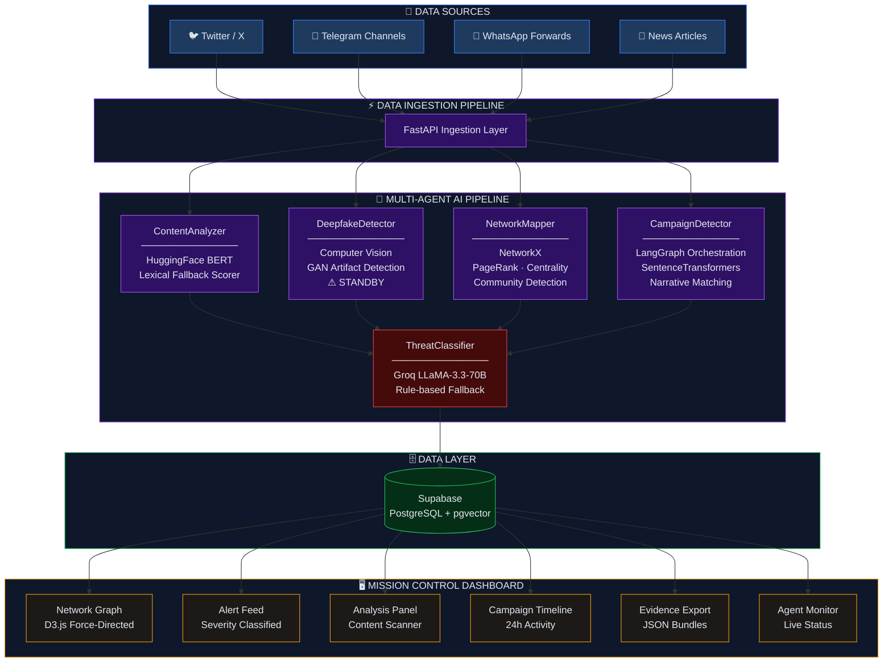
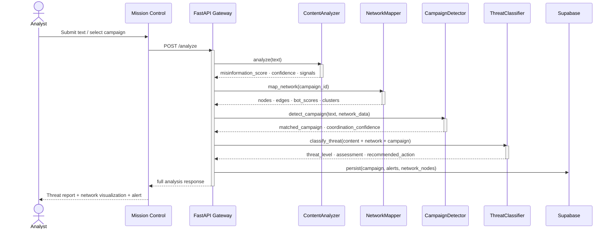
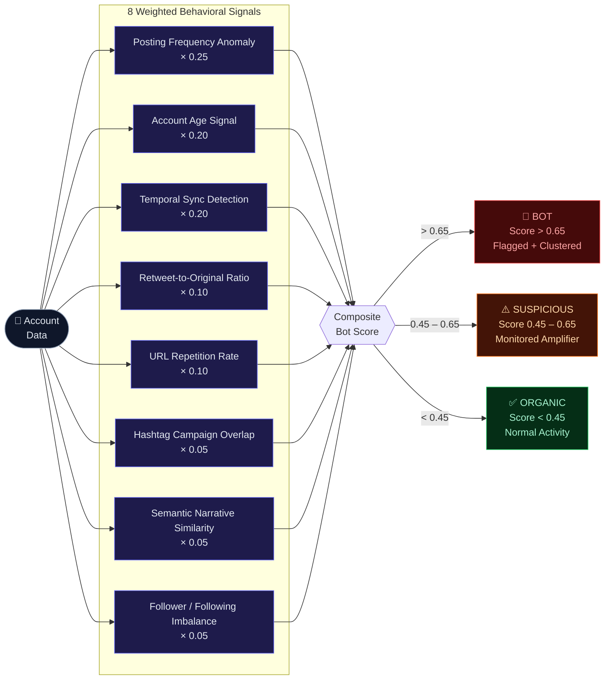
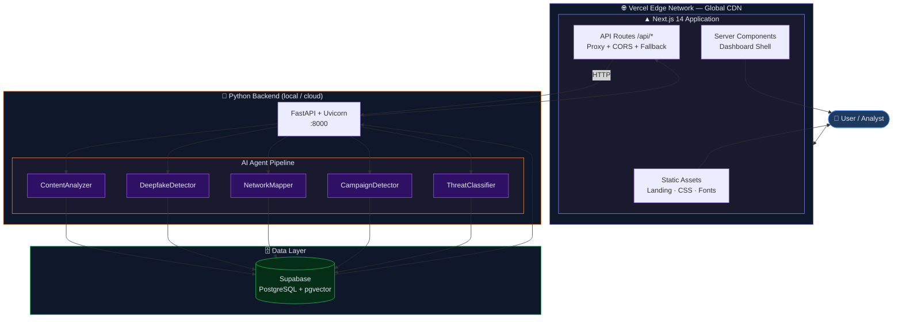

# ShadowTrace — Architecture Diagram

---

## 1. System Architecture Overview

---

## 2. Agent Execution Sequence

---

## 3. Bot Detection Scoring Pipeline

---

## 4. LangGraph Agent State Machine

```mermaid
flowchart LR
    S(["▶ START"])
    CA["ContentAnalysis\nBERT scoring\nSignal extraction"]
    NA["NetworkAnalysis\nGraph construction\nBot scoring"]
    COM["CommunityDetection\nPageRank\nModularity clustering"]
    CM["CampaignMatching\nSemantic similarity\nNarrative matching"]
    E(["⏹ END\nThreat report\ngenerated"])

    S -->|"raw text"| CA
    CA -->|"content result"| NA
    NA -->|"network graph"| COM
    COM -->|"cluster assignments"| CM
    CM -->|"matched campaign\n+ confidence"| E

    style S fill:#052e16,stroke:#22c55e,color:#a7f3d0
    style E fill:#450a0a,stroke:#ef4444,color:#fca5a5

    classDef stateNode fill:#1e1b4b,stroke:#818cf8,color:#e2e8f0
    class CA,NA,COM,CM stateNode
```

---

## 5. Deployment Architecture

---

*ShadowTrace — Detect. Trace. Neutralize.*
