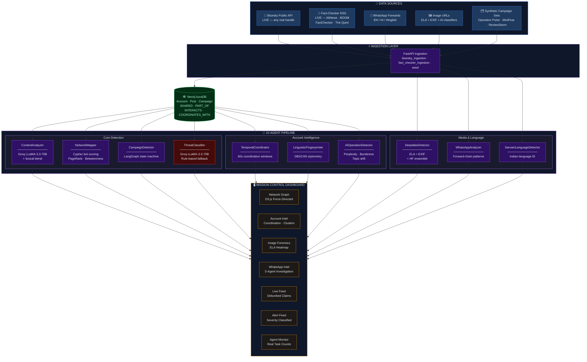
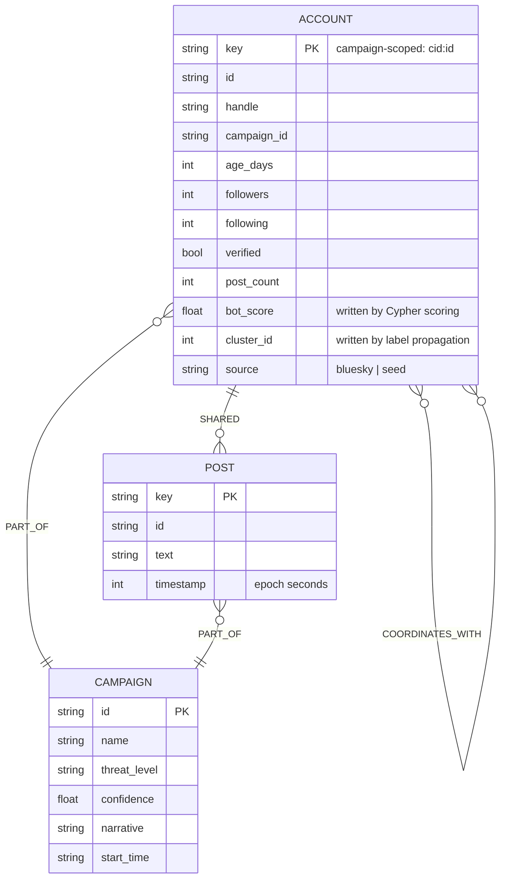
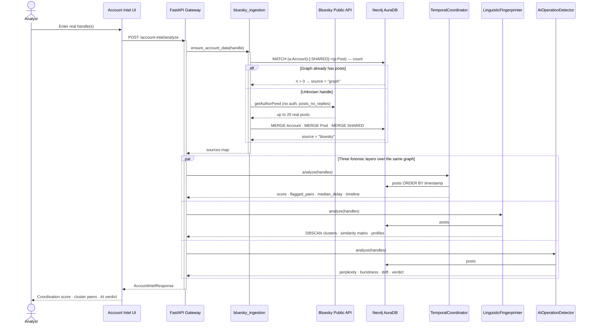
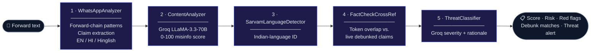
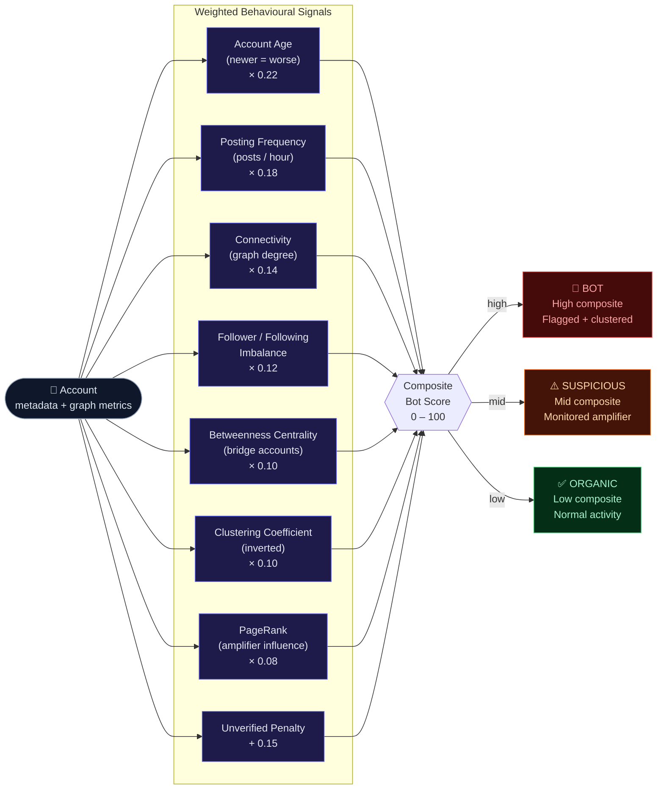
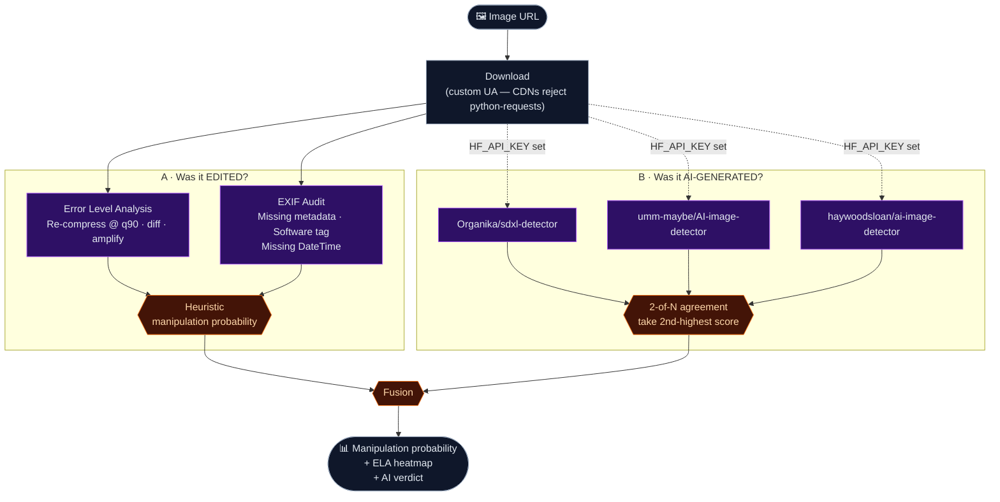
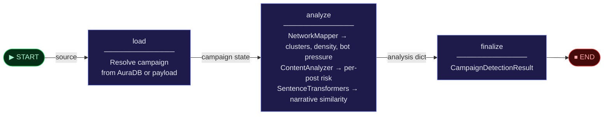
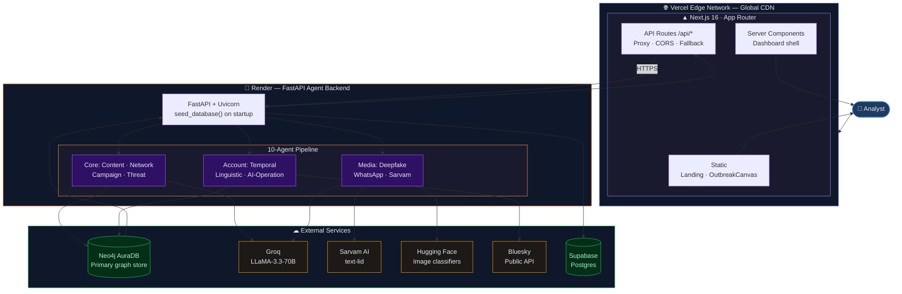
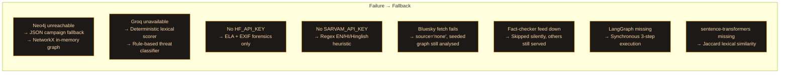

# ShadowTrace — Architecture Diagram

*Phase 2 — 10-agent pipeline on a Neo4j AuraDB graph substrate, with live ingestion.*

---

## 1. System Architecture Overview



---

## 2. Neo4j AuraDB — Graph Data Model

The graph is the substrate, not a cache. Coordination is a **relationship**, so it is stored as one.



**The load-bearing edge — `COORDINATES_WITH`.**
It is *computed*, never seeded. During ingestion, every pair of posts from different accounts landing within **60 seconds** of each other materialises a coordination edge carrying `delay_seconds`. Synchronised amplification therefore stops being an O(n²) batch scan and becomes a **one-hop traversal**.

```cypher
// Bot scoring runs inside AuraDB and persists onto the node
MATCH (a:Account)-[:PART_OF]->(c:Campaign {id: $campaign_id})
SET a.bot_score = (
  CASE WHEN a.post_count > 50            THEN 0.25 ELSE 0 END +
  CASE WHEN a.age_days   < 30            THEN 0.20 ELSE 0 END +
  CASE WHEN a.following  > a.followers*10 THEN 0.20 ELSE 0 END
)
RETURN a.handle, a.bot_score ORDER BY a.bot_score DESC
```

---

## 3. Live Account Intelligence — Execution Sequence

The flow that proves ShadowTrace is not a mock: a **real handle**, ingested live, analysed by three agents through the same Cypher the seeded data uses.



---

## 4. `/investigate` — The 5-Agent Chain

One WhatsApp forward, five agents, streamed step-by-step with real per-agent latency.



**Score fusion.** The agents disagree by design, so the blend is explicit:

```python
if wa.forward_signals or wa.is_forward:      # forward-shaped → trust the LLM more
    final = 0.35 * pattern_score + 0.65 * llm_score
    if llm_score >= 80: final = max(final, 75)
else:                                        # plain text → trust patterns more
    final = 0.6 * pattern_score + 0.4 * llm_score

if fact_check_matches:                       # a known debunk outranks both
    final = max(final, 80)

final = min(final, 97)                       # never claim certainty
```

The cap at 97 is deliberate. A detector that reports 100% confidence is lying.

---

## 5. Bot Detection — Composite Scoring

Eight weighted behavioural signals, computed over graph metrics AuraDB and NetworkX both supply.



Two scoring paths exist. The **Cypher path** (§2) runs inside AuraDB on a coarse three-term rule and persists `bot_score` onto the node. The **composite path** above (`graph/bot_detection.py`) enriches with PageRank, betweenness and clustering, and is what NetworkMapper reports.

---

## 6. Image Forensics — The Two-Model Agreement Rule

Two independent questions, deliberately never allowed to overrule each other.



**Why the second-highest score, not the max?** Every classifier we tested has a family of real photographs it confidently mislabels. Taking the max means **any single liar can flag an image alone**. Taking the second-highest requires **two independent models to agree** — one false positive can never carry the verdict. If only one model responds, its score is clamped below the flagging threshold.

**Why AI-generation cannot veto ELA.** They answer different questions. A real photograph, doctored in Photoshop, is *not* AI-generated — and an early build let the "not AI" verdict suppress the editing evidence, silently clearing manipulated images. Now a confident AI flag can only ever **raise** the score:

```python
if ai_probability is not None and ai_probability >= 0.5:
    manipulation = 0.6 * ai_probability + 0.4 * heuristic   # AI flag raises it
else:
    manipulation = heuristic                                # ELA/EXIF stands alone
```

---

## 7. LangGraph Campaign-Detection State Machine



Confidence fuses three independent views of the same campaign:

```python
graph_behavior = min(100, 35*cluster_count + 300*density + 0.35*bot_pressure)
confidence     = 0.35*content_risk + 0.25*narrative_similarity + 0.40*graph_behavior
campaign_detected = confidence >= 55
```

Note the weighting: **graph behaviour outranks content**. That is the thesis of the whole system expressed as a coefficient — *what* was said matters less than *how it moved*.

If LangGraph is unavailable, `_run_detection` executes the identical three steps synchronously. The state machine is an orchestration choice, never a hard dependency.

---

## 8. Deployment Architecture



**Memory constraint drove real architecture.** Render's free tier caps at 512MB. `torch` + `transformers` OOM on load, which is why ContentAnalyzer is a **Groq API call with a deterministic lexical blend** rather than a local BERT checkpoint, and why `sentence-transformers` is lazily imported behind `lru_cache` instead of loaded at startup. The constraint made the system lighter *and* better: a 70B model beats a fine-tuned BERT-tiny at this task.

---

## 9. Degradation Behaviour

Every external dependency has a defined failure mode. Nothing in the pipeline hard-fails.



---

*ShadowTrace — Detect. Trace. Neutralize.*
